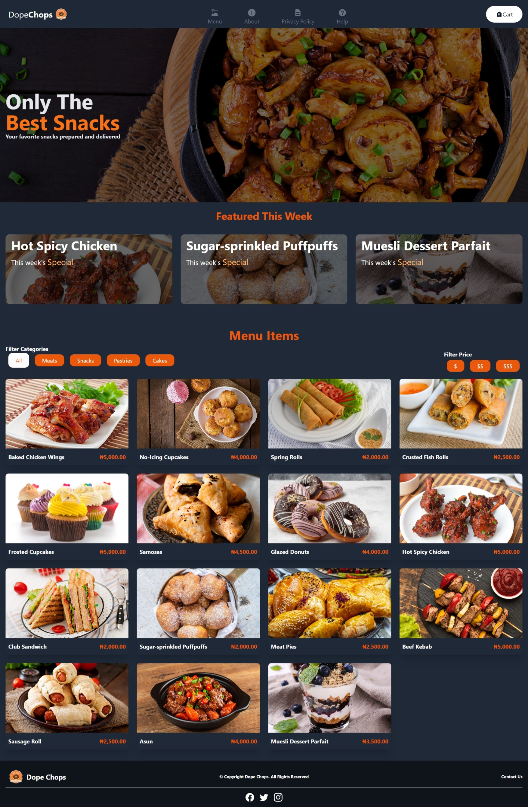

# Dope Chops - Fresh Snacks and Pastries Delivered

This is a web app designed for a small snack/pastry business as an alternative to selling on WhatsApp. Built with React and Typescript

## Table of contents

- [Overview](#overview)
  - [Integrations](#integrations)
  - [Screenshot](#screenshot)
  - [Links](#links)
- [My process](#my-process)
  - [Built with](#built-with)
  - [Continued development](#continued-development)
  - [Useful resources](#useful-resources)
- [Author](#author)
- [Acknowledgments](#acknowledgments)

**Note: Delete this note and update the table of contents based on what sections you keep.**

## Overview

### Integrations

On this site, users are able to:

- View the optimal layout for each of the website's pages depending on their device's screen size
- Make dummy payments via paystack test integration
- Save, update and retrieve information on orders from the backend via Google Firestore

### Screenshot

Site uses Orange, White, Gray and Faded Black colors

### Links

- Live Site URL: [Live Site]()

## My process

### Built with

- Semantic HTML5 markup
- CSS custom properties
- TailwindCSS
- Mobile-first workflow
- [React](https://reactjs.org/) - JS library
- Google [Firestore](https://firestore.google.com/)
- [React-paystack](https://www.npmjs.com/package/react-paystack)

### Continued development

Areas of continued development include:
- Moving images and other details from json file to firebase
- Implementing user-linked carts
- Implementing a search option on the admin page

### Useful resources

- [YouTube](https://www.youtube.com) - I learnt how to use contexts and firebase via multiple videos on YouTube. Unfortunately, I don't have the links to a lot of the videos. I'll update when I find/recall some of them 
- [Stack Overflow](https://stackoverflow.com) - The bestsite to get all your programming questions answered

## Author

- Website - [King Eshiebor](https://www.linkedin.com/in/king-eshiebor-684600207)
- Instagram - [@cant_think_of_a_handle](https://www.instagram.com/cant_think_of_a_handle)